# Duke Asset Management iOS App 


Jiaoyang Chen, [Hugo Hu](https://github.com/0hugohu), [Minghui Zhu](https://github.com/zhuminghui17)

Unpublished Work © 2023 Duke University


## 0. Introduction

### Overview

The Duke Asset Management iOS Mobile App serves as a mobile gateway to MediaBeacon, Duke's extensive digital asset management system. This application enables users to seamlessly view, download, and upload files while ensuring that all modifications are synchronized with the MediaBeacon web server. Designed for convenience and efficiency, this mobile interface is a significant step forward in digital asset management.

### Problems

[MediaBeacon](https://oit.duke.edu/service/mediabeacon/), as the cornerstone of Duke's digital storage, houses over 4 million digital assets, including images, PDFs, videos, and more. Despite its vast capacity and robust web server, MediaBeacon's lack of a mobile application has been a notable shortfall. Users at Duke have frequently reported that this gap in mobile accessibility significantly hampers their work efficiency. The absence of a mobile interface limits the usability and accessibility of the system, particularly for users who rely on mobile devices for their work.

### Solution Impacts
In response to these issues, we have developed a tailored iOS app for MediaBeacon. This solution brings two major impacts:

1. **Economic Saving**: By integrating with the existing MediaBeacon system, our app negates the need for additional software subscriptions. This approach results in substantial cost savings for Duke, optimizing their budget allocation.

2. **Workflow Improvement**: The app is designed to streamline the workflow process. By providing mobile access to MediaBeacon's vast repository, it enhances user productivity and accessibility. This improvement in workflow not only makes the process more efficient but also more adaptable to the modern needs of mobile-centric users.

## 1. Project Structure

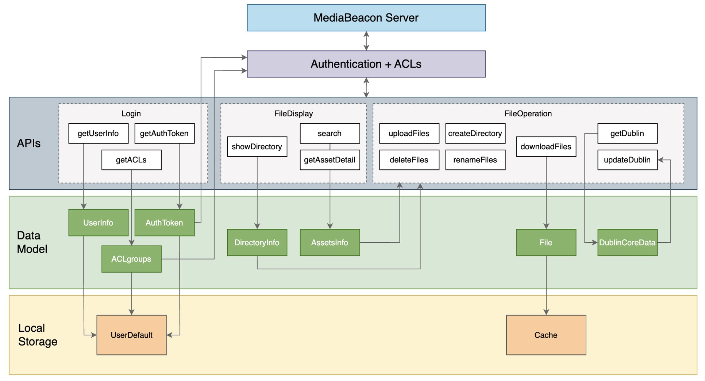

## 2. How to Run 
Clone this repo and open the `DukeAssetMgmt.xcodeproj` file in Xcode. Then, run the app on a simulator or a real device with default scheme.

## 3. Demo

### 3.1. Authentication

- Redirect to the Duke OAuth authentication page
- Upon successful authentication, securely store the **AuthToken** within the iOS **UserDefaults** system. The AuthToken remains valid for a period of **7 days**

<table>
  <tr>
    <!-- Header spanning across two columns -->
    <th colspan="2" style="text-align:center;">Authentication Page</th>
  </tr>
  <tr style="text-align:center;">
    <!-- Images in individual cells, centered -->
    <td></td>
    <td>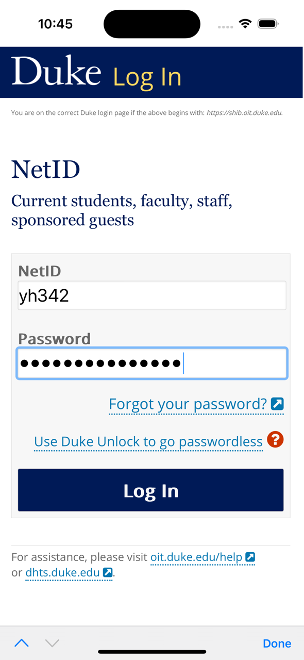</td>
  </tr>
</table>


### 3.2. Browse Folder​

- Switch between **Icon** or **List** view using the toggle on the top-right menu bar
- Organize files by **Name**, **Date**, or **Type**, with options for both ascending and descending order
- Ensure all operations load **asynchronously**, with a **Retry Mechanism** for enhanced reliability

<table>
  <tr>
    <!-- Header spanning across two columns -->
    <th colspan="2" style="text-align:center;">Browse Folder </th>
  </tr>
  <tr style="text-align:center;">
    <!-- Images in individual cells, centered -->
    <td>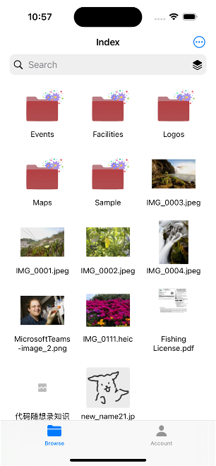</td>
    <td>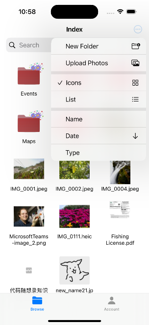</td>
  </tr>
    <tr style="text-align:center;">
    <!-- Images in individual cells, centered -->
    <td>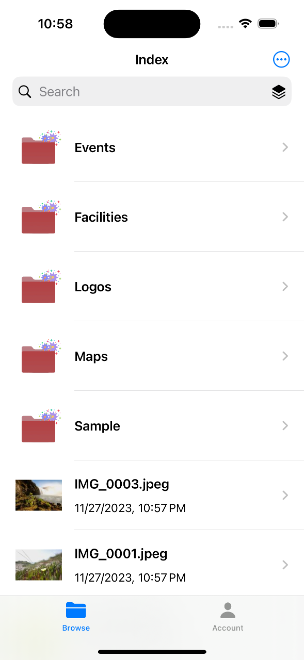</td>
    <td>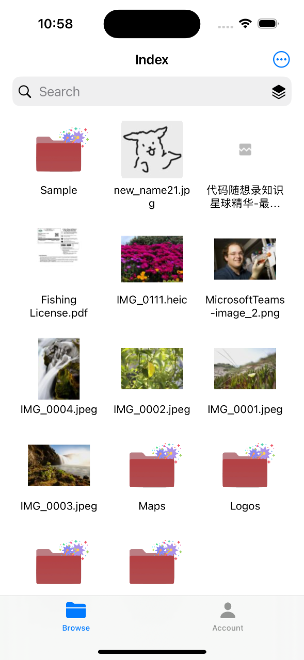</td>
  </tr>
</table>


### 3.3. File Operations​

Basic file operations are supported, including:
1. Create a new folder
2. Rename a folder or file
3. Upload photos from the local
4. Delete a folder or file (If deleting a folder, it will be deleted recursively, and a warning is shown; if the file/folder is not existing, an error is shown)

<table>
  <tr>
    <!-- Header spanning across two columns -->
    <th colspan="3" style="text-align:center;">File Operations </th>
  </tr>
  <tr style="text-align:center;">
    <!-- Images in individual cells, centered -->
    <td>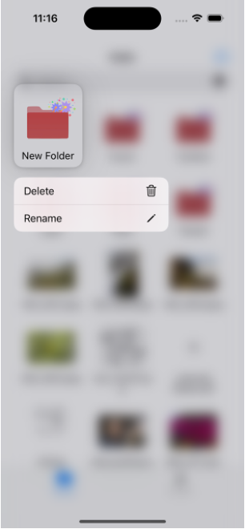</td>
    <td>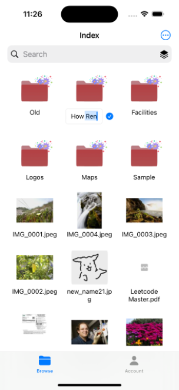</td>
    <td>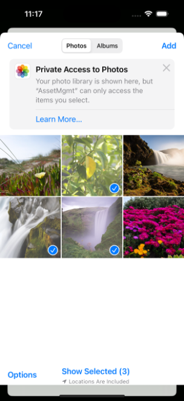</td>
  </tr>
    <tr style="text-align:center;">
    <!-- Images in individual cells, centered -->
    <td></td>
    <td>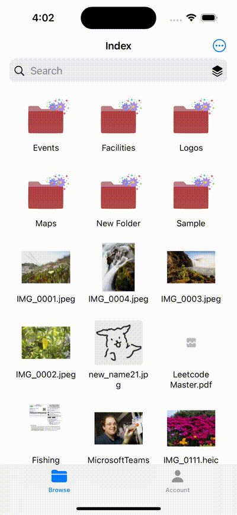</td>

  </tr>
</table>


### 3.4. ACL (Access Control List)

Access Control Lists (ACLs) are a security mechanism that defines who has access to a specific group of assets.
- ACL is supported at the MediaBeacon server end
- User can switch ACL in setting tab

<table>
  <tr>
    <!-- Header spanning across two columns -->
    <th colspan="1" style="text-align:center;"> ACL </th>
  </tr>
  <tr style="text-align:center;">
    <!-- Images in individual cells, centered -->
    <td>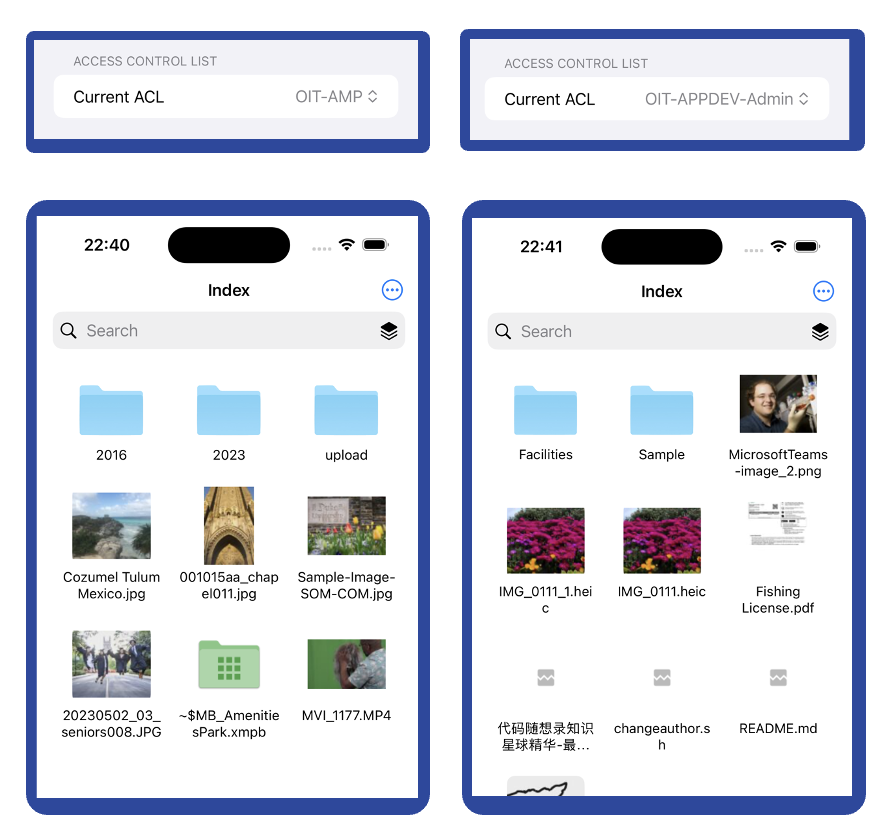</td>
  </tr>
</table>

### 3.5. Search

Note that the search only works in the current ACL (searching across all ACLs is not supported)

- The search functionality within the app is designed with dual scope for user convenience:
    - **Overall**: Allows users to search across all available content
    - **Current Folder**: Searches are limited to the folder currently being viewed, with the folder's path included in the URL for precise results

- The **number of matches** is displayed on the top right

<table>
  <tr>
    <!-- Header spanning across two columns -->
    <th colspan="2" style="text-align:center;">Search </th>
  </tr>
  <tr style="text-align:center;">
    <!-- Images in individual cells, centered -->
    <td>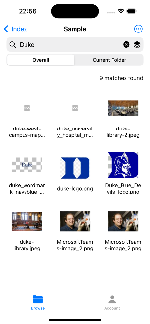</td>
    <td>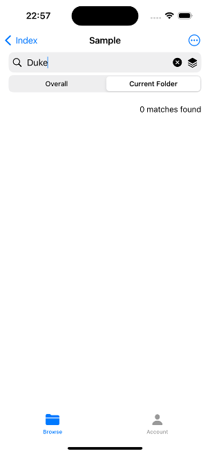</td>
  </tr>
</table>

### 3.6. Advance Search
Allow users to add restrictions on **dates**, **folder names** and **file names**, and allows special *logical conditions*

<table>
  <tr>
    <!-- Header spanning across two columns -->
    <th colspan="2" style="text-align:center;">Advance Search </th>
  </tr>
  <tr style="text-align:center;">
    <!-- Images in individual cells, centered -->
    <td>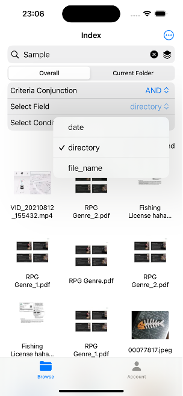</td>
    <td>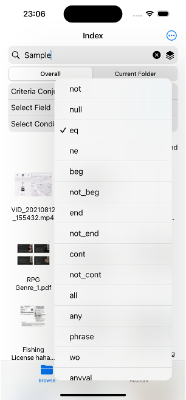</td>
  </tr>
</table>

### 3.7. File Details

Dublin Core Data can be modified in the **File Details** page. The changes will be synchronized with the MediaBeacon server.

<table>
  <tr>
    <!-- Header spanning across two columns -->
    <th colspan="1" style="text-align:center;">File Details </th>
  </tr>
  <tr style="text-align:center;">
    <!-- Images in individual cells, centered -->
    <td>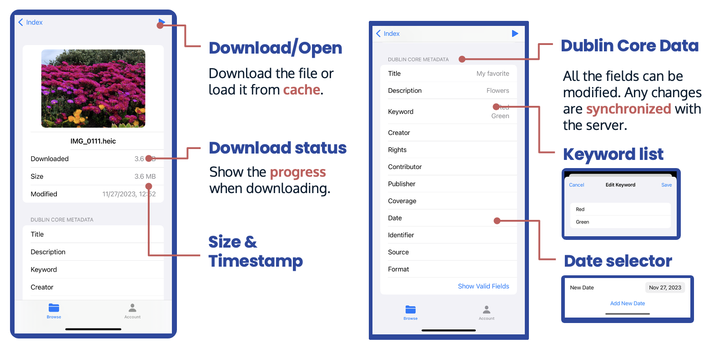</td>
  </tr>
</table>

### 3.8. File Preview
Use the native iOS viewer for most file types, including: PDF, PNG, JPEG, GIF, MP4, MOV, RAW, TXT, etc.

<table>
  <tr>
    <!-- Header spanning across two columns -->
    <th colspan="1" style="text-align:center;">File Preview </th>
  </tr>
  <tr style="text-align:center;">
    <!-- Images in individual cells, centered -->
    <td>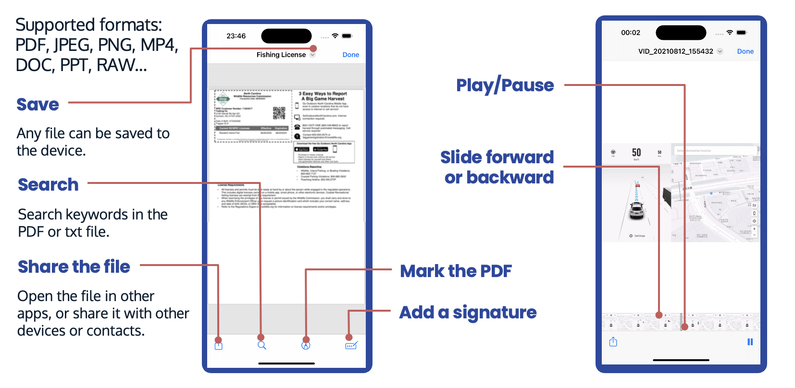</td>
  </tr>
</table>

### 3.9. Themes & Modes

We currently support 4 themes:
- Default Theme
- Christmas Theme
- New Year Theme
- Duke Theme

<table>
  <tr>
    <!-- Header spanning across two columns -->
    <th colspan="1" style="text-align:center;">Themes </th>
  </tr>
  <tr style="text-align:center;">
    <!-- Images in individual cells, centered -->
    <td>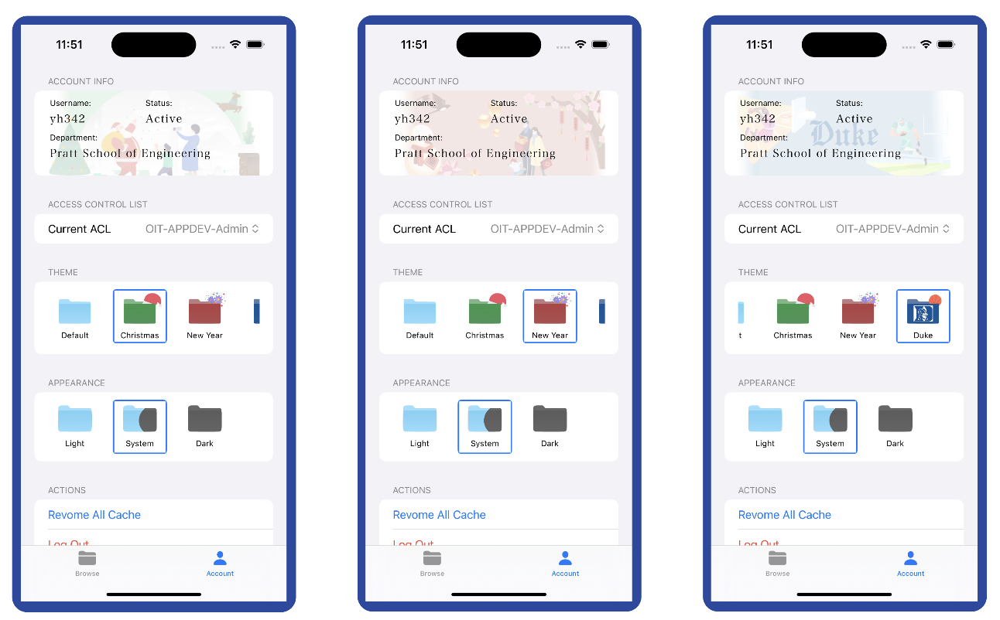</td>

</table>

And we support 3 modes:
- Light Mode
- Dark Mode
- System Setting

<table>
  <tr>
    <!-- Header spanning across two columns -->
    <th colspan="1" style="text-align:center;"> Modes </th>
  </tr>
    <tr style="text-align:center;">
    <!-- Images in individual cells, centered -->
    <td></td>
  </tr>
</table>


## 4. Testing

### 4.1. Unit Test
All core API calls are tested using unit tests. The test cases are located in the `DukeAssetMgmtTests/APITests.swift` file.

```swift
func testAdvancedSearch() throws {
    let expectation = XCTestExpectation(description: "advancedSearch completion called")
    let searchText = SearchFilter.createSearchCriteria(conjunction: .and, fieldId: "directory_id", condition: SearchFilter.OtherField.equals, value: "204788")
    
    advancedSearch(search: searchText, directory: "/", verbose: true) { assetsInfo in
        XCTAssertNotNil(assetsInfo)
        logger.info("First result name: \(assetsInfo![0].id)")
        expectation.fulfill()
    }
    
    // Actual time 0.53 s
    wait(for: [expectation], timeout: 1)
}
```

### 4.2. UI Test
Currently we just have manual UI tests to ensure this app works well on iPhone 13, iPhone 14, and iphone 15 series (including Max and Pro). We will add more UI tests in the future.

Note that although this app can run on iPad, it is not optimized for iPad yet.


## 5. Project Management (Notion)

- Sprint 1: Authentication, PDF Viewer, Upload and Download, API Infrastructure (October 30, 2023 → November 6, 2023)
- Sprint 2: File Browser, Search, File Operations (November 7, 2023 → November 15, 2023)
- Sprint 3: Advanced Search, Dublin Core Data, ACL, Theme (November 16, 2023 → November 28, 2023)

## 6. Full List of API Calls

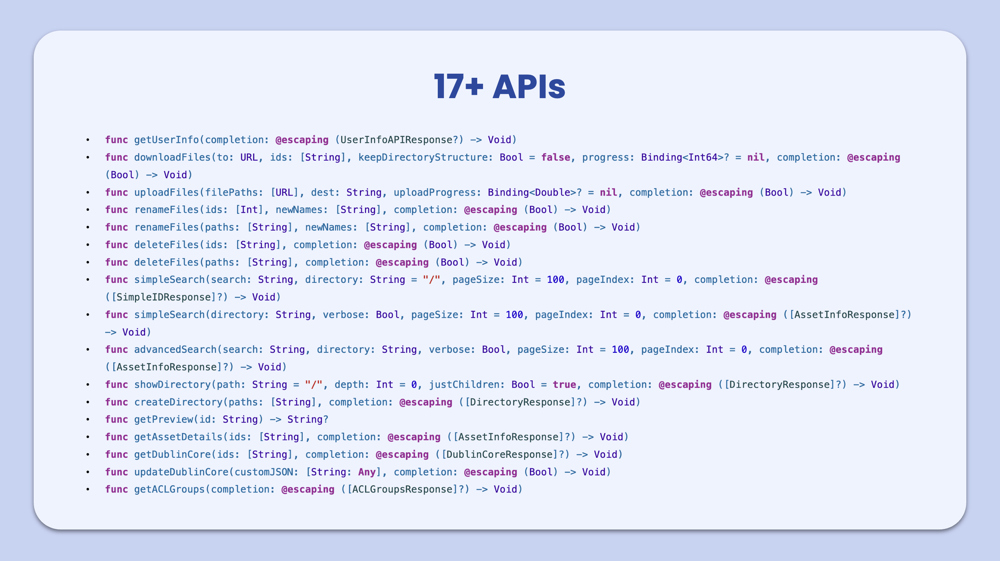


## 7. Acknowledgements

This project utilizes several open-source libraries:

- `Alamofire v5.8.1` - for efficient HTTP networking, supporting resuming interrupted transmissions and handling large file uploads.
- `DirectoryBrowser v0.1.0` - for displaying files in a list view within the app.
- `FilePreviews v0.2.0` - for generating file previews and thumbnails, leveraging native iOS features.
- `PopupView v2.8.3` - for customizable floating dialog animations.
- `Swift-log v1.5.3` - for logging, particularly in concurrent environments.
- `SwiftUI Text Animation Library v0.1.0` - for adding text animations within SwiftUI.
- `WCLShineButton v1.0.8` - for sophisticated button animations in UIKit.
- `Zip v2.1.2` - for compressing and decompressing files locally using Swift.

## 8. License

MIT License